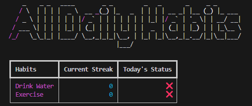

<!-- Improved compatibility of back to top link: See: https://github.com/othneildrew/Best-README-Template/pull/73 -->
<a name="readme-top"></a>
<!--
*** Thanks for checking out the Best-README-Template. If you have a suggestion
*** that would make this better, please fork the repo and create a pull request
*** or simply open an issue with the tag "enhancement".
*** Don't forget to give the project a star!
*** Thanks again! Now go create something AMAZING! :D
-->

<h3 align="center">HabitTic</h3>

  <p align="center">
    A minimal retro inspired CLI(Command Line Interface) habit tracker
    <br />
    <br />

<!-- TABLE OF CONTENTS -->
<details>
  <summary>Table of Contents</summary>
  <ol>
    <li>
      <a href="#about-the-project">About The Project</a>
      <ul>
        <li><a href="#built-with">Built With</a></li>
      </ul>
    </li>
    <li>
      <a href="#getting-started">Getting Started</a>
      <ul>
        <li><a href="#prerequisites">Prerequisites</a></li>
        <li><a href="#installation">Installation</a></li>
      </ul>
    </li>
    <li><a href="#usage">Usage</a></li>
    <li><a href="#acknowledgments">Acknowledgments</a></li>
  </ol>
</details>


<!-- ABOUT THE PROJECT -->
## About The Project


<p align="right">(<a href="#readme-top">back to top</a>)</p>


### Built With

* Typer
* Rich
* Pyfiglet
* SQLite Database
* Pytest
* Inquirer


<p align="right">(<a href="#readme-top">back to top</a>)</p>


<!-- GETTING STARTED -->
## Getting Started

### Prerequisites

These are the libaries that will need to be installed so that the habit tracker will work
* Installing Typer(Comes with Rich)
  ```sh
  pip install typer
  ```

  * Installing Inquirer
  ```sh
  pip install inquirer
  ```

* Installing Pyfiglet
  ```sh
  pip install pyfiglet
  ```

 
### Installation

1. Download the Repo as a zip
2. Unzip the Repo
3. Install All the prerequisites
4. Open the program in your code editor of choice
5. Open a terminal in the Repo's root folder
6. For Help use this command
   ```sh
   python HabitTic.py --help
   ```
7. For the help functions of the other command groups use
   ```sh
   python HabitTic.py Analytics --help
   ```
   ```sh
   python HabitTic.py Habits --help
   ```
8. Please make sure to run the start command everyday as it initalises everything and resets the habits when a certain time period has gone by
   ```sh
   python HabitTic.py Start 
   ```
<p align="right">(<a href="#readme-top">back to top</a>)</p>


<!-- USAGE EXAMPLES -->
## Usage

### 1.Screenshot of Welcome Page


### 2.Screenshot of Daily Page


### 3.Screenshot of Weekly Page


### 4.Screenshot of Summary Page


<p align="right">(<a href="#readme-top">back to top</a>)</p>


<!-- ACKNOWLEDGMENTS -->
## Acknowledgments

* [For Readme Styling](https://github.com/othneildrew/Best-README-Template/tree/master)
* []()
* []()

<p align="right">(<a href="#readme-top">back to top</a>)</p>

